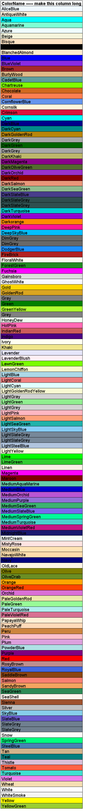
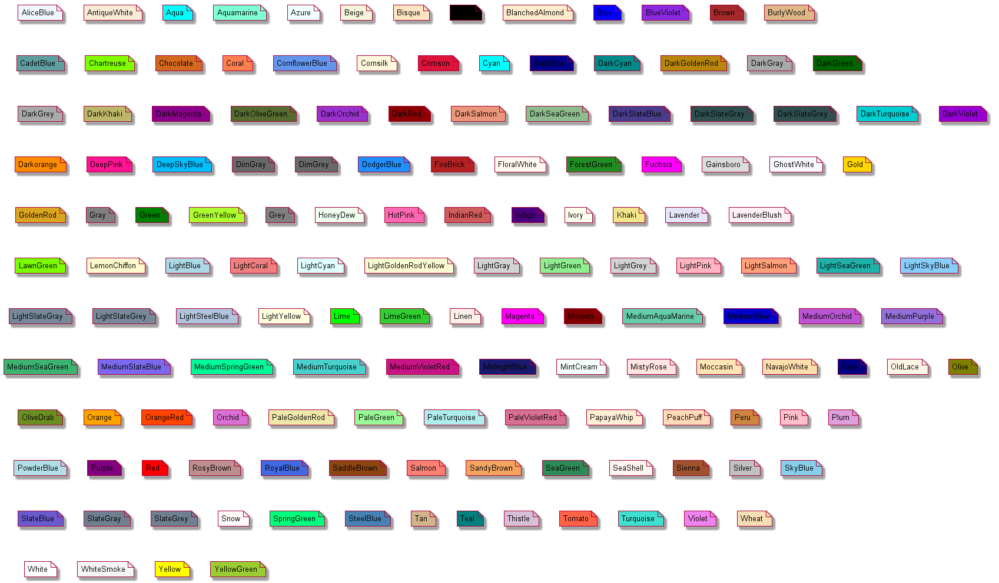

PlantUML-colors
=================
This script is to show all named colors suggested by PlantUML.  
The script extracts colors from `-language` output and creates `.PlantUML`-file-source-diagram. Than it calls **PlantUML** to render picture.

PlantUML colors in table
-----

PlantUML colors in notes
-----

#### [Open-source license](LICENSE)

###### Update
PlantUML authors has created [an article](http://plantuml.com/color) about colors.
